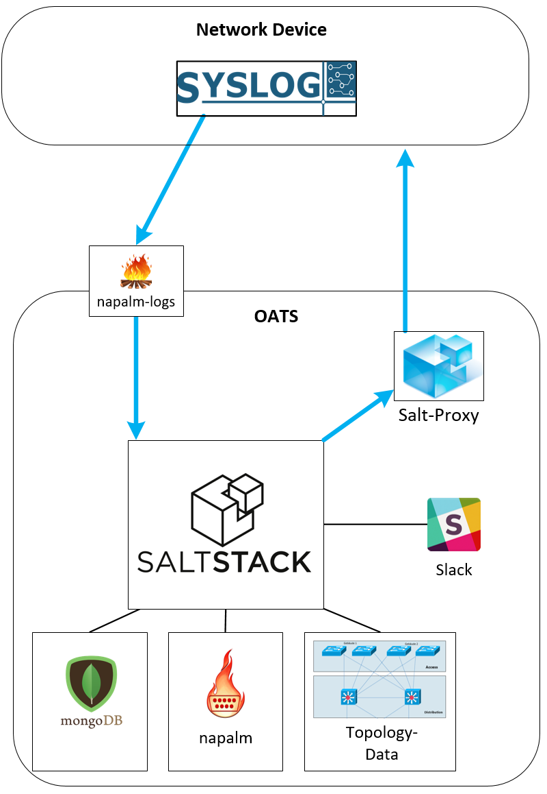

# OATS -Study Project Fall 2017
OATS (Opensource Automated Troubleshooting System) is a system that was developed in fall 2017 during a HSR Rapperswil study project.
Its aim is to provide an automated way to perfom classic troubleshooting in a networking environment, something that is mostly still done manually in most companies.
Knowing that most of1 the stuff we were trying to do was already available in different opensource software, we aimed to identify such tools and combine them in a logical way.

Tools
-----
- Syslog: For identifying when something goes wrong in the network. Sends syslog messages to the napalm-logs listener.
- [napalm-logs](http://napalm-logs.readthedocs.io/en/latest/):For extracting the data from the plaintext syslog messages. Sends the data to a client that was developed during the project. The client constructs salt events and sends them to the salt master. The client is also able to aggregate events, which can give a lot of clues as to where the problem lies.
- [salt](https://github.com/saltstack/salt): Executes troubleshooting workflows once it receives an event from the client. The workflows are directly integrated into salt and act as [salt runners](https://docs.saltstack.com/en/latest/ref/runners/)
- [mongoDB](https://www.mongodb.com/what-is-mongodb): To persist topology data and general data pertaining the workflows.
- [napalm](https://github.com/napalm-automation/napalm): Used to gather data from devices and access their running-config.
- [slack](https://slack.com/): To notify a technician, if OATS can't solve a problem.

Disclaimer
----------
OATS has been developed in a lab environment and as such has never been used in a productive environment.
It is probably not ready to be deployed in a real environment and would require some effort and further testing for that purpose.
OATS will also be the subject of the authors in their bachelors thesis, but it is not yet clear in which direction it is going to be developed.

